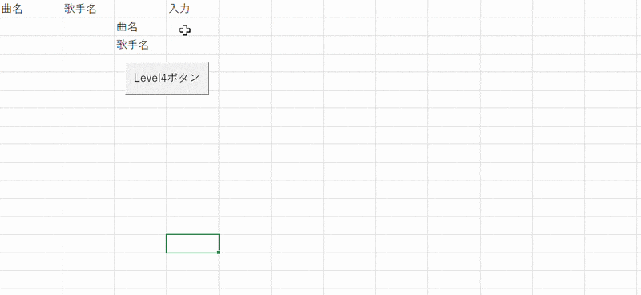
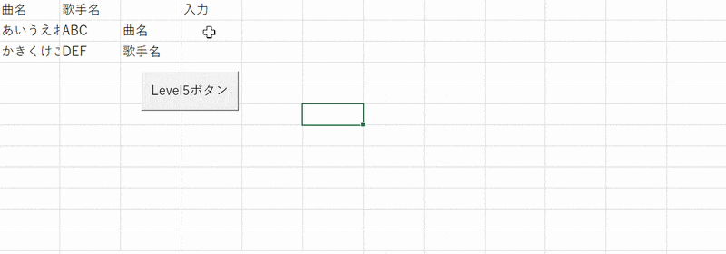

# VBA練習

VBAの基本学習として作成しました。 
VBA学習・制作期間：2026年2月25日～3月19日 

[概要](#概要)｜
[レベル](#レベル)｜
[使用環境と技術](#使用環境と技術)｜
[実行イメージ](#実行イメージ)｜
[苦労や学び](#苦労や学び)｜
[その他](#その他)｜
[進捗](#進捗)｜
[制作物](#制作物)
 

## 概要 
・VBA学習のため、レベル別でのスキル習得を目的としました。 
　（JBA学習：2026年2月25日～　制作期間：2026年2月25日～） 
　　　> [▲ トップへ戻る](#top)

## レベル 
Lebel1　セルA1に「こんにちは！」を表示 
Level2　セルB2に「８５」を表示する、判定メッセージ、「Level2 完了！」表示 
Lebel3　ボタンをクリックして、処理を実行 
Lebel4　フォーム入力で追加 
Level5　重複チェック（同じものは追加しない） 
Level6　リストの合計を出す 
Level7　ランダム抽選 
Level8　複数人ランダム抽選＋履歴管理 
Level9　リスト検索 
Level10　部分一致検索 
Level11　重複チェック（登録前チェック） 
Level12　別シート操作 
Level13　条件付きコピー 
Level14　複数条件で抽出（AND / OR） 
Level15　ミニツール作成（総合） 
　> [▲ トップへ戻る](#top)

## 使用環境と技術 
・実行環境：Excel 
・使用技術：VBA 
　　　> [▲ トップへ戻る](#top)

## 実行イメージ 
Level4 
  
Level5 
  

　　　> [▲ トップへ戻る](#top)
 
## 苦労や学び 
実践しながら知識を覚えるスタイルで学習していきました。 
そのため、まずコードを書いて実行してイメージをつかんでから、 
コードの内容を確認していきました。 
基礎知識を身につけながら、別で実践的なものを作成して、 
基礎で使ってないものをまた覚えていくようにしていきました。 
それぞれが復習のようなものになり、また実践的なものも作成でき、楽しく学習できました。 
新しくできることが増えれば、さらにやりたいこともでき、 
さらに難しいこともしたい気持ちがでてきたので、今後も引き続き学習していきたいと思いまいます！ 
　　　> [▲ トップへ戻る](#top)

## その他 
 
　　　> [▲ トップへ戻る](#top)

## 進捗 
2026年2月25日　level1 
2026年2月26日　level2 
2026年3月2日　level3 
2026年3月3日　level4 
2026年3月4日　復習＆ループ＆シートへコピー 
2026年3月5日　復習＆修正 
2026年3月6日　level5 
2026年3月9日　level6 
2026年3月10日　level7 
2026年3月11日　level8 
2026年3月12日　level9 
2026年3月13日　level10 
2026年3月16日　level11 
2026年3月17日　level12 
2026年3月18日　level13 
2026年3月19日　level14、15 
　　　> [▲ トップへ戻る](#top)
   
## 制作物 
　【 コマンドプロンプトで実行 】 
・じゃんけんゲーム：[janken-java](https://github.com/kita-izu-13/janken-java) 

　【 Webアプリで実行 】 
・じゃんけんゲーム：[janken-ss](https://github.com/kita-izu-13/janken-ss) 
・掲示板アプリ：[bbs-ss](https://github.com/kita-izu-13/bbs-ss) 
・メモアプリ：[memo-ss](https://github.com/kita-izu-13/memo-ss) 
・メタ認知トレーニングゲーム：[modeme-ss](https://github.com/kita-izu-13/modeme-ss) 

　【 Androidアプリで実行 】 
・じゃんけんゲーム：[janken-android](https://github.com/kita-izu-13/janken-android) 
　　　> [▲ トップへ戻る](#top)
